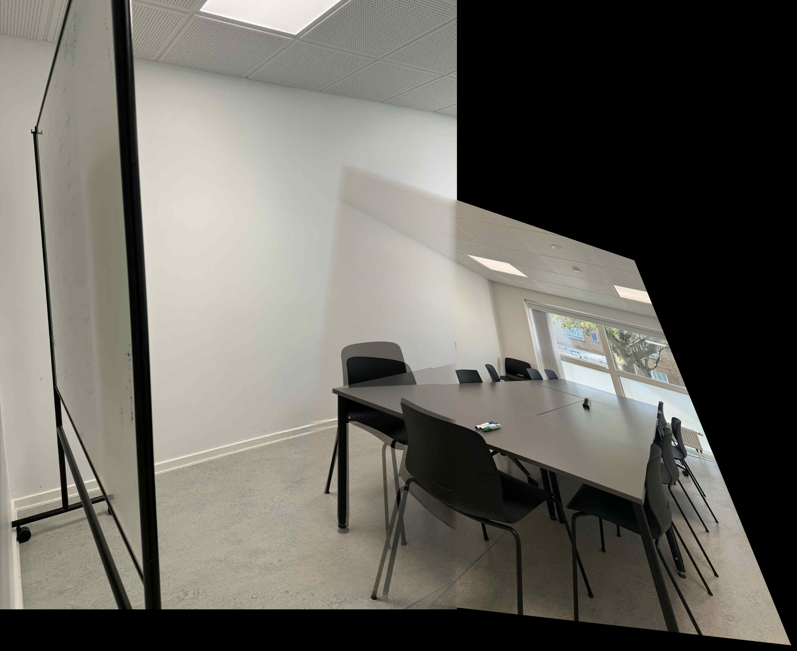

# Panorama Stitching Assignment Report

_First-person voice ("I")_

## Abstract
I built a panorama stitching system for Visual Computing Assignment 1. It detects local features (ORB, AKAZE, SIFT), matches them with k-NN and Lowe’s ratio, estimates a planar homography with RANSAC, warps one image into the other, and blends the overlap (overlay, feathering, or multiband). I evaluate indoor and outdoor pairs, sweep the RANSAC reprojection threshold, and compare blending methods. On these scenes, ORB is the most reliable; changing the RANSAC threshold from 1–5 px barely affects outcomes because inliers and outliers are well separated. Multi-image stitching is more fragile when overlap is low. This report describes the method, results, and practical takeaways.

## Introduction
Panorama stitching combines overlapping photos into a single wide view. I follow a standard workflow: detect keypoints, describe them, match correspondences, fit a robust geometric model, warp, and blend. When the camera primarily rotates or the scene is approximately planar, the mapping between views is a 3×3 homography \(H\) with \(x' \sim Hx\) in homogeneous coordinates. I use RANSAC to separate inliers from outliers before warping and then handle seams with blending.

## Methodology
I use three detectors. ORB combines FAST keypoints with a rotated BRIEF descriptor, giving fast binary descriptors matched with Hamming distance. AKAZE builds a non-linear scale space and produces MLDB binary descriptors. SIFT produces more expensive floating-point descriptors that are robust to scale and rotation. For ORB and SIFT I cap features at about 5k–50k depending on the run; AKAZE uses a detection threshold (≈0.001) with 4 octaves and 4 layers and is trimmed to the same feature budget when needed.

I first convert images to grayscale for detection while keeping the original color for later blending. I match descriptors using brute-force k-NN with k=2 (Hamming for ORB/AKAZE, L2 for SIFT) and filter ambiguous pairs with Lowe’s ratio test at 0.75. From the filtered matches I estimate a homography with RANSAC: each trial samples four correspondences, computes a candidate H, and counts inliers whose reprojection error is below a threshold τ. I sweep τ in {1, 2, 3, 4, 5} pixels (default 3 px), target 0.995 confidence with at most 2000 iterations, then refit H from all inliers. I warp the second image into a canvas sized by transforming its corners and adding a small translation and padding so the panorama coordinates are positive. Finally, I blend overlaps either by simple overwrite, by feathering (distance-transform weights with ~30 px radius), or by multiband blending (≈5-level Laplacian pyramid with Gaussian mask pyramids, automatically reduced if memory is tight). The system also saves visualisations of keypoints, matches, and inliers.

## Experimental Setup
I evaluate three datasets supplied with the assignment: indoor scenes with rich texture, an outdoor campus facade, and a second outdoor sequence containing foliage and structural elements. Each dataset contains three frames captured with overlap but varying baselines. I execute sixty configurations: nine adjacent image pairs per detector, fifteen runs spanning five RANSAC thresholds, nine blending trials, and the remaining tests covering sequential multi-image stitching. I parse runtime logs into structured metrics containing keypoint counts, good matches, inliers, inlier ratios, and success flags. I store representative panoramas, correspondence visualisations, and aggregated statistics under `results/` and `results_analysis/`.

## Results
I compared detectors on adjacent pairs (1–2, 2–3) and a harder 1–3 wide-baseline case. ORB solved eight of nine pairs with roughly 157 tentative matches and 82 inliers on average (≈52% inlier ratio). AKAZE solved six of nine with about 113 matches and 57 inliers. SIFT produced many matches but fewer successful homographies on the wide-baseline pairs because overlap was limited.

Sweeping the RANSAC reprojection threshold from 1 to 5 pixels barely changed success or inlier counts. Inliers fall well below 1–2 px while outliers are much larger on these scenes, so this range sits on a plateau. Blending does not affect geometry but does change seam appearance: multiband blending yields the smoothest transitions, while simple overlay shows visible seams.

Sequential three-image stitching often failed when overlap was low. The first stitch stretches geometry, and the next homography becomes ill-conditioned. Visualising inliers shows a loss of well-distributed support after the first step.

## Discussion
These results match expectations. ORB’s fast binary features provide robust correspondences under modest overlap; AKAZE is competitive on some textures but detects fewer keypoints with the current settings; SIFT’s richer descriptors cannot compensate for insufficient overlap. The flat response to τ in 1–5 px reflects clear inlier/outlier separation on these stable scenes.

In harder conditions (parallax, motion, exposure changes) both the ratio threshold and τ would become more influential. For seams, photometric variation dominates appearance; multiband blending helps at the cost of compute. The failures in sequential stitching expose the limits of purely pairwise homographies. Practical remedies include global optimisation across all images (pose graph + loop closure), cylindrical projection for wide fields of view, and better exposure compensation. Structured logging of metrics would also improve reproducibility and analysis.

## Conclusion
A classical feature-based pipeline reliably stitches adjacent views with enough overlap. ORB is a strong default on these datasets. A 3 px RANSAC threshold is sensible because results are insensitive across 1–5 px. Multi-image stitching would benefit from global optimisation and alternative projections (e.g., cylindrical) when overlap is limited. Future work: global alignment, seam placement, exposure compensation, and structured logging.
